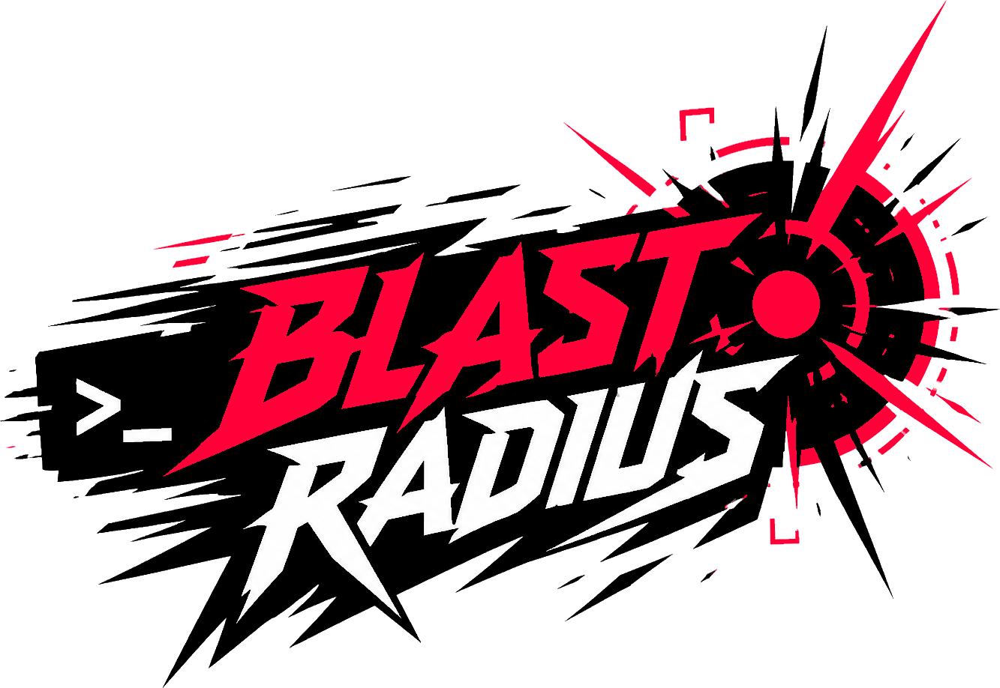

<p align="center">
  
</p>

# blast-radius

**When you change a file, find out what else might break.**

`blast-radius` is a fast CLI that traces every file that depends — directly or
transitively — on the code you're about to touch, and gives you a one-glance
risk verdict. Point it at a file and it answers the question every code review
asks: _"how far does this change reach?"_

```
   MODERATE   ██████████░░░░░░░░░░  6 impacted files · 2 packages
  3 direct, 3 indirect · depth 2 · 1 endpoint

  ── IMPACTED FILES · 6 IN 2 PACKAGES ──────────────────────
  apps/storefront (3)
    src/ (3)
      App.tsx  ◎ endpoint
      LegacyButtonCard.jsx
      PromoCard.tsx
  packages/ui (3)
    src/ (3)
      Card.tsx
      Toolbar.tsx
      index.ts
```

Use it to:

- **Gut-check a change** before you start — is this a 2-file tweak or a 200-file ripple?
- **Catch surprises in code review** — surface the files a diff touches that aren't in the diff.
- **Gate risky commits in CI or pre-commit hooks** — fail the build when a change reaches too far.

It is built first and foremost for JavaScript and TypeScript repos (including
monorepos) — and that includes React: JSX/TSX is parsed natively, and JSX
component usage is tracked at the symbol level, so it can tell a file that
merely imports `Button` from one that actually renders `<Button />`. Vue and
Svelte are first-class too, with Python and Rust as beta adapters.

## Quick start

Install via npm — no Rust toolchain required. The package pulls in a prebuilt
binary for your platform (Linux x64/arm64, macOS x64/arm64, Windows x64) with
**all language features included**:

```bash
npm install --save-dev blast-radius-cli

npx blast-radius --help
```

The same prebuilt binaries are attached to each
[GitHub Release](https://github.com/ehermanson/blast-radius/releases) if you'd
rather download one directly.

Or build from source (requires a Rust toolchain with `cargo`):

```bash
# From crates.io
cargo install blast-radius

# Straight from GitHub
cargo install --git https://github.com/ehermanson/blast-radius

# Or from a local clone
cargo install --path .
```

Then point it at any file in your repo:

```bash
# What depends on this component?
blast-radius file src/components/Button.tsx

# What depends on a specific export?
blast-radius export src/components/Button.tsx Button

# Check several files at once (e.g. everything in a commit)
blast-radius files src/components/Button.tsx src/components/Card.tsx
```

By default it analyzes the current directory. Use `--repo-root` to point
elsewhere:

```bash
blast-radius --repo-root ../my-app file src/App.tsx
```

## Use it in pre-commit hooks and CI

The most common setup is to run `blast-radius` on changed files so you (and
your reviewers) see the reach of a commit before it lands.

`files` takes a list of paths and reports each file's blast radius plus a
combined total. Pass `-` to read the list from stdin — the natural fit for
piping from git:

```bash
# What does my working-tree change reach?
git diff --name-only | blast-radius files -

# Gate a PR on everything it touches
git diff --name-only origin/main...HEAD | blast-radius --fail-on-risk risky files -
```

It also receives staged filenames as arguments from hook managers like
`lint-staged`, Husky, Lefthook, and `pre-commit`. For example, with
`lint-staged`:

```json
{
  "lint-staged": {
    "*.{js,jsx,ts,tsx}": "bash -c 'blast-radius --repo-root . files \"$@\" || true' --"
  }
}
```

To turn the verdict into a gate, exit non-zero when a change reaches too far:

```bash
# Fail (exit code 2) if a change impacts more than 50 downstream files
blast-radius --fail-threshold 50 files "$@"

# Or fail when the risk verdict hits "risky" or above
blast-radius --fail-on-risk risky files "$@"
```

Exit codes: `0` no gate tripped, `1` analysis error, `2` gate tripped, `64`
usage error (so CI can tell a misspelled flag apart from a tripped gate).

See `docs/local-toolchain.md` for ready-to-paste examples with `lint-staged`,
Lefthook, and the `pre-commit` framework.

## Reading the output

The default `tree` output leads with a **risk verdict** — `minor`, `moderate`,
`risky`, or `high` — plus a meter and the counts behind it. For larger blast
radii a **hotspots** chart follows, showing the directories with the most
impacted files, so you can see where the change lands before reading any paths.

The impacted files are then listed grouped by package and directory. Files
marked `◎ endpoint` are leaves nothing else depends on (apps, routes, pages) —
a signal the change can reach something user-facing. Past 200 impacted files
the per-file lists collapse to directory rollups; pass `-v` to list every file.

The last line reports **confidence**: how many files were scanned and whether
any import edges were ambiguous, so you know how much to trust the result.

Pass `--verbose` (`-v`) to see the full root → cascade tree of exactly how the
impact propagates.

## Commands

| Command                | What it does                                        |
| ---------------------- | --------------------------------------------------- |
| `file <path>`          | Everything that depends on this file.               |
| `export <path> <name>` | Everything that depends on a specific named export. |
| `files <path>...`      | Blast radius for each file plus a combined total. `-` reads the list from stdin. |
| `graph`                | Dump the whole-repo import graph (every file and resolved import edge). |
| `completions <shell>`  | Print a completion script (bash, zsh, fish, elvish, powershell). |

Install completions by writing the script where your shell looks for them,
e.g. `blast-radius completions zsh > ~/.zfunc/_blast-radius` (zsh, with
`~/.zfunc` in `fpath`) or
`blast-radius completions bash > /etc/bash_completion.d/blast-radius`.

Global flags:

| Flag                                  | Purpose                                             |
| ------------------------------------- | --------------------------------------------------- |
| `--repo-root <dir>`                   | Repo to analyze (default: current directory).       |
| `--format <tree\|json\|mermaid\|dot>` | Output format (default: `tree`).                    |
| `--output <file>`                     | Write output to a file instead of stdout.           |
| `--verbose`, `-v`                     | Show the full cascade tree.                         |
| `--quiet`, `-q`                       | No stdout output; exit codes and `--output` still apply. |
| `--color <auto\|always\|never>`       | ANSI color handling (default: `auto`; `NO_COLOR` respected). |
| `--explain-unresolved`                | Group unresolved internal imports by likely cause.  |
| `--fail-threshold <n>`                | Exit code 2 when more than `n` downstream files are impacted (the changed files themselves are not counted). |
| `--fail-on-risk <tier>`               | Exit code 2 when the verdict is at or above `tier`. |

`--version` prints the version plus the language adapters compiled into the
binary, so you can tell a JS/TS-only source build from the full prebuilt one.

### Output formats

- `tree` — the default human-readable verdict, meter, and impacted-file list.
- `json` — structured output; the per-input-file breakdown lives in the `roots`
  array. Carries a top-level `schema_version` (currently `1`), bumped only on
  breaking shape changes — new fields may appear without a bump. The full
  field-by-field contract is in `docs/json-output.md`.
- `mermaid` — a Mermaid graph definition.
- `dot` — Graphviz DOT.

## Language support

The default binary supports **JavaScript and TypeScript** (`js`, `jsx`, `ts`,
`tsx`) — React codebases are the primary target, with symbol-level JSX
component usage tracking and `React.lazy()`/dynamic `import()` detection —
including ESM imports/exports, CommonJS `require`/`module.exports`,
default and named exports, barrels, `export *`, side-effect imports
(`import './setup'`), `tsconfig.json` path aliases, `baseUrl`, `extends`
chains (including `tsconfig.base.json`-style shared configs), project
`references` (aliases in referenced configs like `tsconfig.lib.json` are
honored), package `imports`/`exports`, the `browser` entry field,
`.js` specifiers backed by TypeScript source files,
`.d.ts` declaration files, and cross-package resolution across workspace
packages.

Other languages are compiled in at **build time** with Cargo features (there is
no runtime `--language` flag — a binary scans whatever was built into it). The
**prebuilt binaries** (the `blast-radius-cli` npm package and GitHub Release
downloads) ship with **all language features already compiled in**, so this
only matters when building from source:

```bash
cargo install --path .                              # JS/TS only (default)
cargo install --path . --features vue,svelte        # + Vue + Svelte
cargo install --path . --features python            # + Python (beta)
cargo install --path . --features rust              # + Rust (beta)
cargo install --path . --features python,rust,vue,svelte   # everything
```

**Vue and Svelte** ride the same battle-tested JS/TS pipeline (script blocks
are extracted and parsed as TypeScript/JavaScript). The **Python and Rust**
adapters use real parsers and work well on conventionally structured repos,
but are labeled beta: see `docs/language-support.md` for their known blind
spots before trusting them on an unconventional layout.

Ruby and Java adapters were removed in 0.3.0 — their heuristic parsers were
not accurate enough on real codebases to trust, and a wrong "looks safe"
answer is worse than no answer (`docs/language-support.md` has the details;
0.2.1 is the last release that included them).

## Configuration

An optional `.blast-radius.json` at the repo root lets a repository declare
tooling quirks the analyzer shouldn't hardcode. Today it supports ignoring
import specifiers that point at generated/virtual modules (CSS-in-JS codegen,
route type stubs, published `dist` output, etc.) so they don't count against the
unresolved-import confidence signal:

```jsonc
{
  // comments and trailing commas are allowed (parsed as JSONC, like tsconfig)
  "unresolved": {
    "ignore": ["styled-system/css", ".velite", "/+types/"],
  },
}
```

Each entry is matched as a substring of the import specifier. Asset imports
(`.svg`, `.css`, `.json`, images, …) and type-only imports are ignored
automatically. See `examples/chakra-ui/.blast-radius.json`.

## Examples

The `examples/` directory has runnable fixtures for each supported language:

| Fixture                     | Exercises                                                    |
| --------------------------- | ------------------------------------------------------------ |
| `monorepo-demo`             | Aliases, barrels, CommonJS, transitive React usage           |
| `vite-react-ts`             | A real Vite React + TypeScript template                      |
| `chakra-ui` †               | Chakra UI snapshot for large-repo stress testing             |
| `python-demo` / `fastapi` † | Python package, relative, and `__init__.py` reexport imports |
| `rust-demo`                 | `mod`, `pub use`, `crate::` / `self::` imports               |
| `component-demo`            | Mixed Vue/Svelte component imports                           |

† `chakra-ui` and `fastapi` are large real-world snapshots that aren't committed
to the repo. Fetch them on demand (pinned to a known upstream commit) before
running their examples:

```bash
scripts/fetch-examples.sh
```

Run against any of them with `--repo-root`:

```bash
# JS/TS monorepo fixture
cargo run --bin blast-radius -- --repo-root examples/monorepo-demo file apps/storefront/src/App.tsx

# Large React monorepo, with the full cascade tree
cargo run --bin blast-radius -- --repo-root examples/chakra-ui -v file packages/react/src/components/button/button.tsx

# Python (needs the feature compiled in)
cargo run --features python --bin blast-radius -- --repo-root examples/fastapi file fastapi/applications.py

# Rust
cargo run --features rust --bin blast-radius -- --repo-root examples/rust-demo file src/utils/formatting.rs

# Vue/Svelte
cargo run --features vue,svelte --bin blast-radius -- --repo-root examples/component-demo file src/shared.ts
```

## Development

This project expects a Rust toolchain with `cargo` available locally. Common
quality commands:

```bash
make test                 # core JS/TS test suite
make test-all-languages   # every optional adapter
make coverage             # coverage report
make quality              # full quality gate
```

The `Makefile` has the full set, including per-language test/quality/stress
targets (`make test-python`, `make stress-chakra`, etc.). See `docs/quality.md`
for what each command validates and `docs/language-support.md` for the
multi-language architecture.
