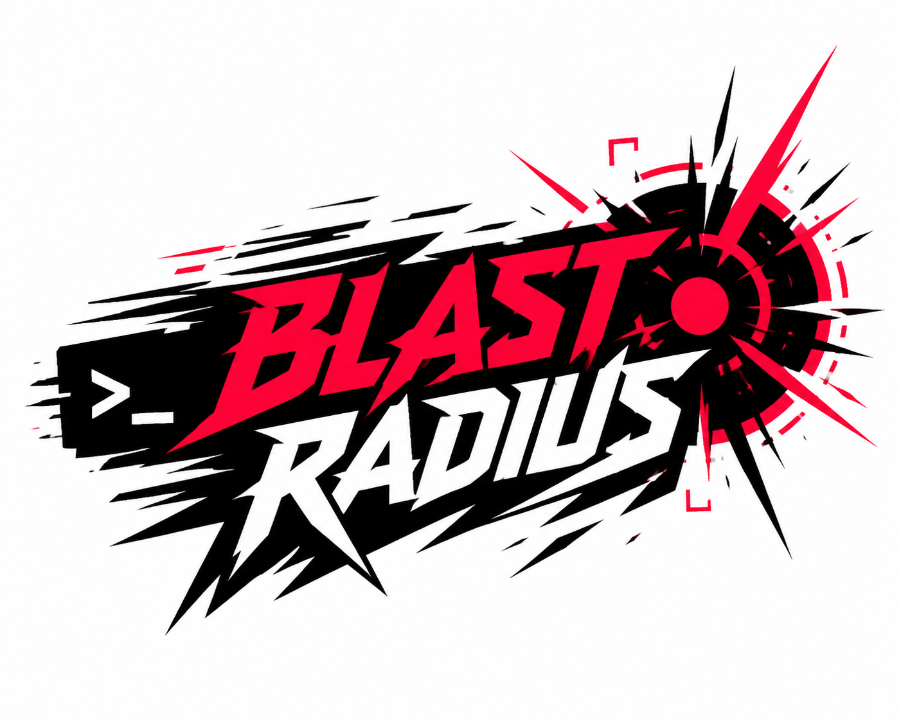

<p align="center">
  
</p>

# blast-radius

`blast-radius` is a Rust CLI for estimating the transitive impact of frontend code changes across a repository.

## Features

- AST-based parsing for `ts`, `tsx`, `js`, and `jsx`
- ESM imports/exports and CommonJS `require` / `module.exports`
- Default exports, named exports, barrels, and `export *`
- `tsconfig.json` path aliases
- Cross-package resolution for in-repo workspace packages
- Optional Vue single-file component support behind `--features vue`
- Optional Svelte component support behind `--features svelte`
- Optional Python support behind `--features python`
- Optional Rust support behind `--features rust`
- Optional Ruby support behind `--features ruby`
- Optional Java support behind `--features java`
- Terminal tree, JSON, Mermaid, and Graphviz DOT output
- At-a-glance risk verdict (minor / moderate / risky / high) with impacted files listed per package
- Multi-file runs show a combined verdict plus a per-file breakdown
- `export`, `file`, and `files` modes

## Commands

```bash
blast-radius export packages/ui/src/Button.tsx Button
blast-radius file packages/ui/src/Button.tsx
blast-radius files packages/ui/src/Button.tsx packages/ui/src/Card.tsx
```

`files` takes a list of paths and reports each file's blast radius plus a combined
total. It is designed for tools like `lint-staged`, Husky, Lefthook, and the
`pre-commit` framework to pass changed filenames in explicitly.

## Local Pipeline Usage

Install the binary:

```bash
cargo install --path .
```

Install with optional frontend component support first if the repo uses Vue or
Svelte:

```bash
cargo install --path . --features vue,svelte
```

Then call `blast-radius files` from your existing hook manager. For example,
with `lint-staged`:

```json
{
  "lint-staged": {
    "*.{js,jsx,ts,tsx,vue,svelte}": "bash -c 'blast-radius --repo-root . files \"$@\" || true' --"
  }
}
```

See `docs/local-toolchain.md` for hook-manager examples with `lint-staged`,
Lefthook, and the `pre-commit` framework.

## Language Support

Language support is selected at build time with Cargo features, not runtime CLI
flags. The default binary supports JS/TS only.

```bash
# JS/TS only
cargo build

# JS/TS + Python
cargo build --features python

# JS/TS + Rust
cargo build --features rust

# JS/TS + Vue + Svelte
cargo build --features vue,svelte

# JS/TS + Ruby
cargo build --features ruby

# JS/TS + Java
cargo build --features java

# JS/TS + every optional adapter
cargo build --features python,rust,vue,svelte,ruby,java
```

There is no `--language` or `--languages` CLI flag yet. A binary scans whatever
file types were compiled into it.

## Output Formats

- `tree` — leads with a risk verdict and meter, then (for multi-file runs) a per-input-file breakdown, then the impacted files listed in full and grouped by package, with endpoints flagged. Pass `--verbose` (`-v`) for the full root → cascade tree. The per-file breakdown is also available in `json` as the `roots` array.
- `json`
- `mermaid`
- `dot`

## Configuration

An optional `.blast-radius.json` at the repo root lets a repository declare
tooling-specific quirks the analyzer shouldn't hardcode. Currently it supports
ignoring import specifiers that point at generated/virtual modules (CSS-in-JS
codegen, route type stubs, published `dist` output, etc.) so they don't count
toward the unresolved-import signal:

```jsonc
{
  // comments and trailing commas are allowed (parsed as JSONC, like tsconfig)
  "unresolved": {
    "ignore": ["styled-system/css", ".velite", "/+types/"]
  }
}
```

Each entry is matched as a substring of the import specifier. Asset imports
(`.svg`, `.css`, `.json`, images, …) and type-only imports are ignored
automatically and need no configuration. See `examples/chakra-ui/.blast-radius.json`.

## Examples

- `examples/monorepo-demo`
  A purpose-built workspace fixture that exercises aliases, barrels, CommonJS, and transitive React component usage.
- `examples/vite-react-ts`
  A real React + TypeScript template copied from Vite.
- `examples/chakra-ui`
  A vendored snapshot of the Chakra UI monorepo for large-repo stress testing.
- `examples/python-demo`
  A small Python package that exercises package imports, relative imports, and
  `__init__.py` reexports.
- `examples/fastapi`
  A vendored snapshot of FastAPI for large Python repo stress testing.
- `examples/rust-demo`
  A small Rust crate that exercises `mod`, `pub use`, and `crate::` / `self::`
  imports.
- `examples/component-demo`
  A small mixed Vue/Svelte fixture that exercises component script imports and
  default component imports.
- `examples/ruby-demo`
  A small Ruby project that exercises `require_relative`, classes, modules, and
  methods.
- `examples/java-demo`
  A small Java project that exercises packages, imports, and public classes.

Example run:

```bash
cargo run --bin blast-radius -- --repo-root examples/monorepo-demo export packages/ui/src/Button.tsx Button
```

More example runs:

```bash
# Analyze a single file in the small monorepo fixture
cargo run --bin blast-radius -- --repo-root examples/monorepo-demo file apps/storefront/src/App.tsx

# Analyze a symbol export in the small monorepo fixture
cargo run --bin blast-radius -- --repo-root examples/monorepo-demo export packages/ui/src/Button.tsx Button

# Analyze a real Vite React app file
cargo run --bin blast-radius -- --repo-root examples/vite-react-ts file src/App.tsx

# Stress test against a larger React monorepo
cargo run --bin blast-radius -- --repo-root examples/chakra-ui file packages/react/src/components/button/button.tsx

# Show the full cascade tree for the same Chakra UI file
cargo run --bin blast-radius -- --repo-root examples/chakra-ui --verbose file packages/react/src/components/button/button.tsx

# Analyze a Python package fixture
cargo run --features python --bin blast-radius -- --repo-root examples/python-demo file app/utils/formatting.py

# Stress test against a larger Python repo
cargo run --features python --bin blast-radius -- --repo-root examples/fastapi file fastapi/applications.py

# Analyze a Rust crate fixture
cargo run --features rust --bin blast-radius -- --repo-root examples/rust-demo file src/utils/formatting.rs

# Analyze a mixed Vue/Svelte component fixture
cargo run --features vue,svelte --bin blast-radius -- --repo-root examples/component-demo file src/shared.ts

# Analyze a Ruby fixture
cargo run --features ruby --bin blast-radius -- --repo-root examples/ruby-demo file lib/app/utils/formatter.rb

# Analyze a Java fixture
cargo run --features java --bin blast-radius -- --repo-root examples/java-demo file src/main/java/com/example/util/Formatter.java
```

## Development

This project expects a Rust toolchain with `cargo` available locally.

Useful local quality commands:

```bash
make test
make test-python
make test-rust
make test-components
make test-ruby
make test-java
make test-all-languages
make coverage
make coverage-gate
make stress-chakra
make stress-python-demo
make stress-fastapi
make stress-rust-demo
make stress-components
make stress-ruby-demo
make stress-java-demo
make smoke-mui
make perf
make metrics
make quality
make quality-python
make quality-rust
make quality-components
make quality-ruby
make quality-java
```

See `docs/quality.md` for what each command validates.

See `docs/local-toolchain.md` for install instructions and non-blocking
hook-manager examples.

See `docs/language-support.md` for the multi-language architecture and next
language-adapter work.
